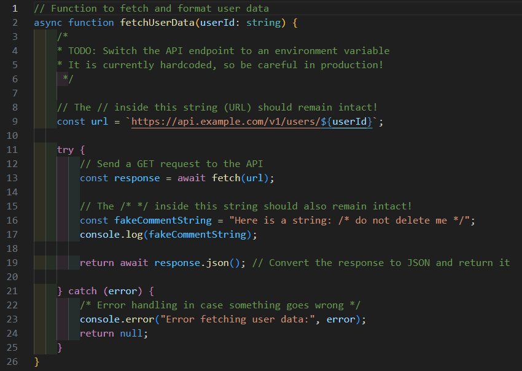

# Delete Comments

文字列リテラル内の文字は安全に保護しつつ、開いているファイルのコメントアウトをすべて削除します。

## Demo

## Usage

ショートカットキーを入力するだけです。

* **Windows / Linux**: `Ctrl` + `Shift` + `/`
* **Mac**: `Cmd` + `Shift` + `/`

Finish! 🚀

---

### Option (Settings)
* `delete-comments.preserve42Header` (default: `true`)
  * 42 school の標準ファイルヘッダーを削除せずに保持します。

## GitHub
https://github.com/rui319420/delete-comments